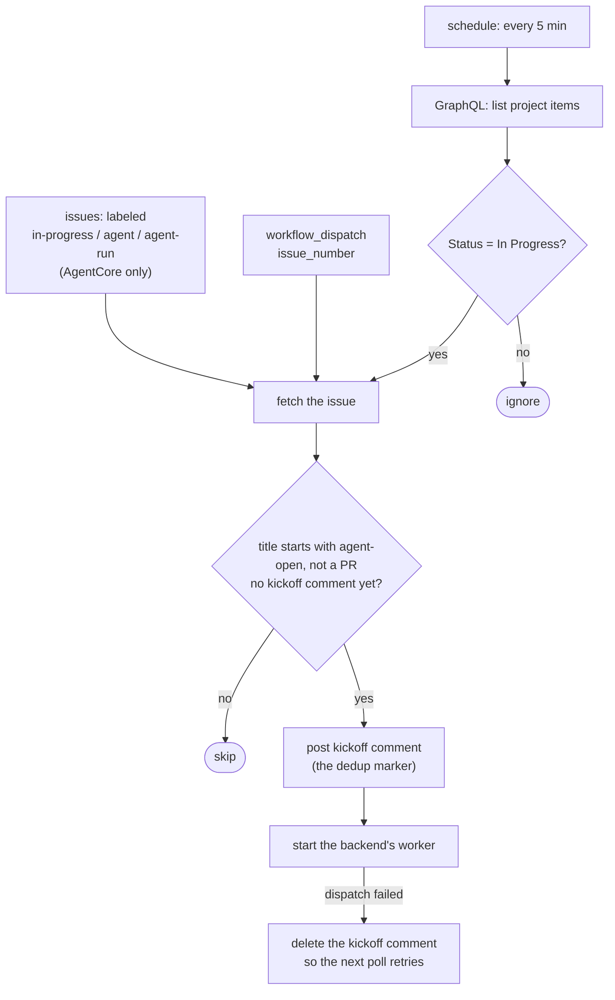
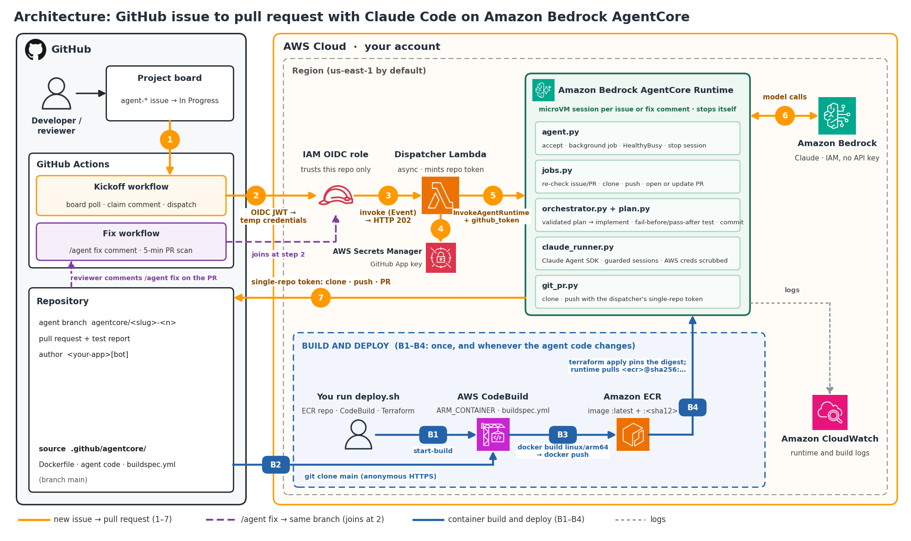
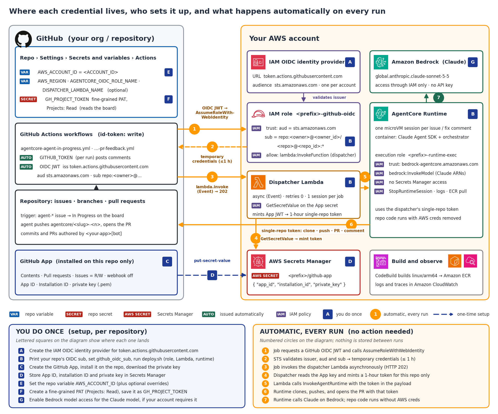
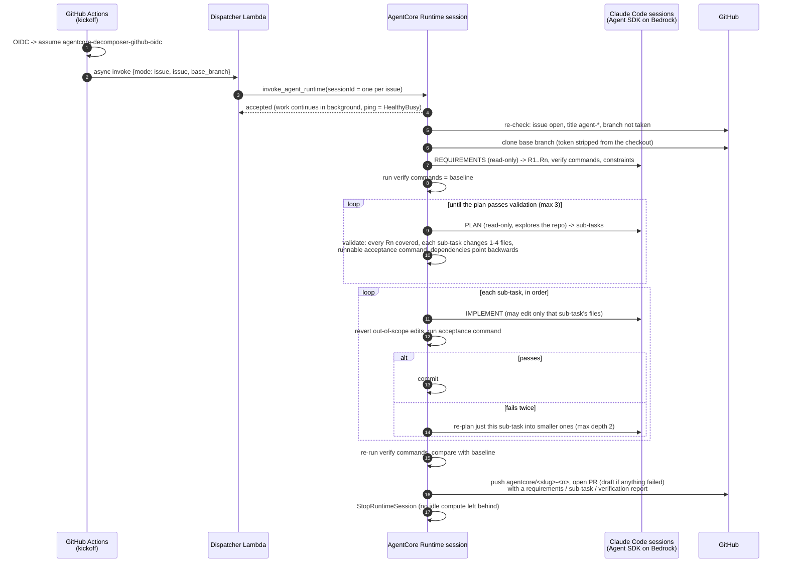
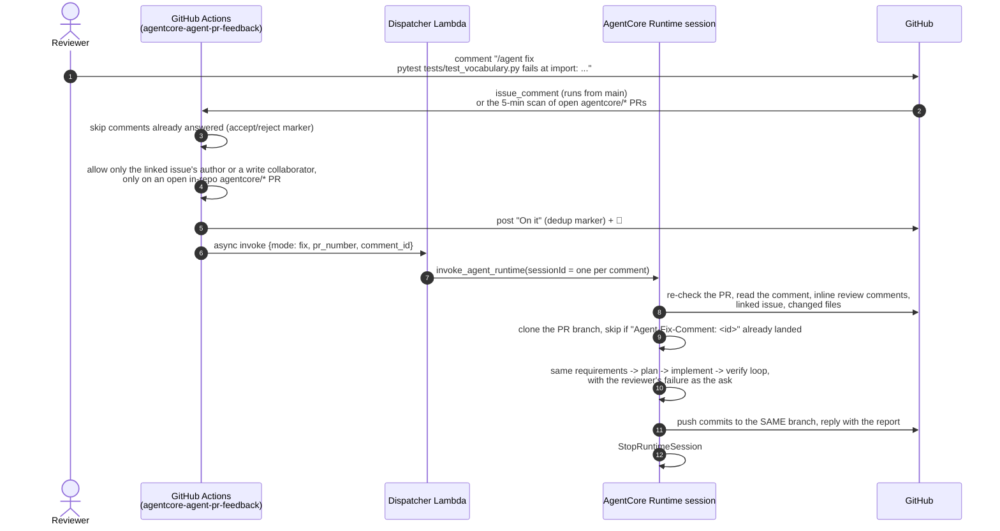
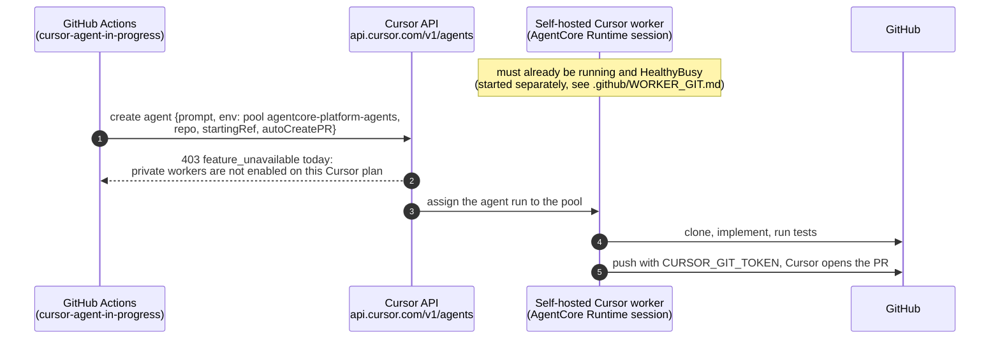

# kaushalavardhanam
This is a group created with an intent to up-skill members while enabling them to build something valuable and long lasting. The group includes Engineering students, IT Professionals, SamskritaBharati Volunteers and aspirants who intend to learn and wear multiple hats.

This repository is for bootstrapping initiatives being led under Kaushalavardhanam. Students/ aspirants can use this as inspiration to continue building in the project specific repositories

## Ideation Document
The purpose of the projects for various cohorts in this repo are meant to provide seed resources to ensure projects proposed are feasible, achievable within stipulated period that students are able to commit to and to ensure the cohorts are successful in completing the products without having to evaluate multiple paths. 

- Cohort 1 - ZatamOnAWS - This document has the actual game build developed in ZatamOnAWS (Temporary name) folder. Final project is available https://github.com/skopp002/Sanskrit_Family_Feud_GameShow/tree/Survey
- Cohort 2 - [speaking_buddy](speaking_buddy/) - A Streamlit-based Luxembourgish pronunciation learning tool with Praat-based phonetic analysis
- Cohort 3 - [mitra](mitra/) - A multilingual conversational robot with vision and audio capabilities for Sanskrit and Kannada

## Cloud coding agents on the project board

📝 **Write-up:** [GitHub issues to PRs with AgentCore](https://builder.aws.com/content/3D3N36mItBxfGxSpbKdxPvG5NFN/github-issues-to-prs-with-agentcore) on AWS Builder Center walks through the design of the active AgentCore backend below.

Issues titled `agent-*` on the [kaushalavardhanam org project board](https://github.com/orgs/kaushalavardhanam/projects/1) get picked up automatically when moved to **In Progress**: an agent plans the issue, implements and tests it, and opens a PR. Reviewers can then comment `/agent fix <what failed>` on that PR and the agent pushes a fix to the same branch.

There are two backends. Only the AgentCore one runs on its own.

| Backend | Status | How it starts | Where the agent runs | Workflows |
|---|---|---|---|---|
| **AgentCore + Claude Code** | **active** | Board poll every 5 min, an issue label, or a manual run. `/agent fix` comments are answered on the comment event and by a 5-min scan. | A Bedrock AgentCore Runtime session (serverless microVM, one per job) running the Claude Agent SDK on Amazon Bedrock | `agentcore-agent-in-progress.yml`, `agentcore-agent-pr-feedback.yml` |
| Cursor Cloud Agent | off | Manual `workflow_dispatch` only | A long-lived self-hosted Cursor worker hosted on AgentCore | `cursor-agent-in-progress.yml` |

**Using it:**
- Title the issue `agent-<short description>` and move it to **In Progress** (or add an `in-progress`, `agent` or `agent-run` label).
- By default the agent branches off and opens its PR against `main`. To target a different branch, add a `base:<branch-name>` label to the issue (e.g. `base:release-1.2`), or pass `base_branch` explicitly on a manual `workflow_dispatch` run.
- Write a "Done when" section with runnable commands (e.g. `cd mitra && pytest tests/test_x.py -q`): the agent turns it into its verify step.
- On the PR, `/agent fix` followed by what failed (the command and the error) gets a fix pushed to the same branch.

**Security note:** this repo is public, so anyone can open an issue, including one titled `agent-*` with a crafted body. That alone doesn't trigger anything: it still takes someone with repo write/triage access adding the label, or someone with project-board access moving it to In Progress. `/agent fix` is honoured only from the linked issue's author or a write collaborator. Because the issue body and fix comments become instructions to an agent that can push branches and spend Bedrock budget, **read the issue body before labeling it or moving it to In Progress**. Don't triage on title alone.

### 1. How the kickoff watches the board

This is the AgentCore kickoff (`kick_agentcore_agent.py`); the Cursor kickoff applies the same `agent-*` filter but only on a manual run. The AgentCore kickoff posts its kickoff comment *before* dispatching, so a later poll never starts the same issue twice, and withdraws it only if the dispatch itself fails. The base branch is `main`, a `base:<branch>` label on the issue, or the `base_branch` input of a manual run.

### 2. AgentCore + Claude Code (active)

**Architecture.** The path from an issue to a PR (steps 1–7), how `/agent fix` joins at step 2, and the one-time container build and deploy (B1–B4):

**Control flow.** One run end to end: kickoff (about 20 seconds), the agent run inside AgentCore, and delivery of the PR:

**Credentials and trust.** Where each credential lives, the setup you do once per repository (A–G), and what happens automatically on every run (1–7):

The sequence below is the same run in more detail.

Nothing runs between jobs: Actions minutes are spent only on the 5-minute board poll, and a runtime microVM exists only while a job is in flight. The Claude sessions never hold the GitHub token, cannot `git commit`/`push`, use the network tools, or edit files outside their sub-task.

### 3. Reviewer feedback: `/agent fix`

The comment event starts a fix within seconds. A scheduled run every 5 minutes (and a manual run, optionally for one PR) also scans every open `agentcore/*` PR for `/agent fix` comments that never got a reply, such as ones whose event run was dropped or whose dispatch failed. Accepted and rejected comments both get a reply with a per-comment marker, so the scan never answers the same comment twice. All runs share one concurrency group, so the event run and the scan can't dispatch the same comment at once.

### 4. Cursor Cloud Agent on an AgentCore worker pool (off, manual only)

It runs only from a manual `workflow_dispatch` with an issue number. The `schedule` trigger is commented out and it doesn't answer labels. To use it again, three things are needed: a valid `CURSOR_API_KEY` (the current one has expired), private workers enabled on the Cursor plan, and a running worker session. Unlike the AgentCore backend, the worker is a long-lived session that has to exist *before* work arrives, and it needs its own GitHub PAT (see [.github/WORKER_GIT.md](.github/WORKER_GIT.md)). The worker image and Terraform live in [cursor-cookbook](https://github.com/skopp002/cursor-cookbook/tree/main/self-hosted-cloud-agent/agentcore). It also comments after starting the agent rather than before, and doesn't check that the issue is open.

### 5. Swapping Claude Code for Kiro inside AgentCore (not implemented)

What would change to run Kiro instead of Claude Code in the AgentCore backend. Only the coding engine changes. The board watcher, `/agent fix`, dispatcher, session-per-job lifecycle, orchestrator, plan validator, git/PR code and Terraform stay as they are, because `orchestrator.py` only calls `runner.run(prompt, write_paths=..., schema=...)`. Checked against `kiro-cli` 2.27.0 and `kirocrew` as installed here; re-check the flags against the version you deploy.

**Pick the engine: `kiro-cli`, not Kiro Crew.**
- **`kiro-cli chat --no-interactive`** runs one headless session and exits, which matches one fresh session per step. Use this.
- **Kiro Crew (`kirocrew`)** is a personal agent *gateway*: a long-running server with a dashboard, memory and messaging channels. Its `kirocrew cloud` mode provisions your own EC2 instance, which is always-on rather than serverless. `kirocrew run TASK.md` runs a whole task with its own planner and test loop. Using it would replace `orchestrator.py`, along with the requirement-coverage and acceptance checks that `plan.py` enforces in code.

**What to update**

| Piece | With Claude Code (today) | With Kiro |
|---|---|---|
| Session runner | `claude_runner.py` → `claude_agent_sdk.query()` | New `kiro_runner.py` with the same `run()` signature. It runs `kiro-cli chat --no-interactive --output-format stream-json --agent <generated> "<prompt>"` with `cwd` = the checkout, and reads the JSON Lines events for the final answer. |
| Authentication | `CLAUDE_CODE_USE_BEDROCK=1` + the runtime's IAM execution role | **Blocker.** `kiro-cli login` only signs in a *person* (Builder ID / social, or IAM Identity Center for Pro) through a browser or OAuth device flow. There is no IAM-role or workload-identity login, so a fresh microVM per job cannot authenticate unattended. This is the gap filed in `mitra/kiro-cloud-agents-pfr.md`. Until Kiro supports it, the only workaround is copying a signed-in user's token into Secrets Manager and refreshing it, which runs every job as that person. |
| Model + IAM | `BEDROCK_MODEL_ID`; `bedrock:InvokeModel` on Claude Sonnet 5.5 | Inference goes through Kiro's service under the signed-in identity, so `local.bedrock_model_ids` / `agentcore_runtime_bedrock` in `main.tf` would no longer be needed. Pick the model with `--model` (`kiro-cli chat --list-models` lists what the account can use). |
| Structured output (requirements, plan) | `output_format` JSON schema → `ResultMessage.structured_output` | No schema-validated output option. Ask for a single JSON object in the final message, validate it with `jsonschema` against `plan.REQUIREMENTS_SCHEMA` / `PLAN_SCHEMA`, and treat a parse failure as a plan violation. The planner already retries up to 3 times with the violation list. |
| Tool guard | Python `PreToolUse` hook calling `check_tool()` | Write a throwaway agent JSON per session. Set `tools` / `allowedTools` to `fs_read`, `fs_write`, `shell` (no `web_fetch`, no `subagent`) and `toolsSettings.shell.allowedCommands` to the Bash allowlist in `claude_runner.py`. Restrict write paths with an `fs_write` path setting or a `preToolUse` hook script that calls `check_tool()`. Agent files here only show `agentSpawn` / `userPromptSubmit` / `postToolUse` hooks, and `postToolUse` cannot block, so confirm blocking `preToolUse` support first. Pass `--trust-tools=<that list>`, never `--trust-all-tools`. The orchestrator's revert-out-of-scope step stays as the backstop either way. |
| Budgets | `max_turns`, `max_budget_usd`, `ResultMessage.total_cost_usd` | No per-session dollar cap. Enforce a wall-clock limit (`subprocess` timeout) per session and count events from the stream; `AGENT_BUDGET_USD` would become a time or step budget. |
| Repo settings | `setting_sources=["project"]` (repo `CLAUDE.md`) | Kiro reads project steering/specs from `.kiro/`; commit those per project instead of a `CLAUDE.md`. |
| Image | `claude-agent-sdk` wheel (bundles the Claude Code CLI) | Install the linux/arm64 `kiro-cli` binary in the `Dockerfile` instead and drop `claude-agent-sdk` from `requirements.txt`. The rest of the image (test venv, git, ripgrep) is unchanged. |
| Tests | `ScriptedRunner` stands in for Claude | Unchanged: the orchestrator and job tests never call the engine. Add `kiro_runner` tests for building the CLI arguments and parsing the event stream. |

**Bottom line:** the code changes are mostly confined to one new runner module plus the Dockerfile. What blocks it is unattended authentication, not the code. Until `kiro-cli` can sign in with an IAM role, Kiro can't run in a serverless, session-per-job runtime without borrowing a person's login.

### 6. Next steps: runs longer than 1 hour

**Limitation.** An AgentCore run that takes more than about an hour from dispatch does all of its work but can't publish it. No request times out: the dispatcher returns within seconds, and the runtime session runs in the background (`HealthyBusy`), well under AgentCore's default `maxLifetime` of 8 hours. The real limit is the GitHub token.

- The dispatcher mints a single GitHub App installation token and passes it in the payload. These tokens expire **1 hour** after they are minted.
- Since the change that took Secrets Manager away from the runtime role, `agent.run_job` hands the jobs `get_token=lambda: token`. Every `get_token()` call returns that same token. The `jobs.py` docstring still says the token "is re-minted for the push", which is no longer true.
- After an hour, `git_pr.push`, `git_pr.create_pr` and the result comment all get `401`. The failure comment (`_reply`) uses the same expired token, so nothing appears on GitHub. The only trace is the runtime's CloudWatch logs, and the commits are lost when the session stops.

**How to fix it**, in order:

1. **Re-mint without giving the runtime the App key.** Add a small token-vending Lambda (or a second handler in the dispatcher). The runtime role gets `lambda:InvokeFunction` on that one function. The function reads the App secret and returns a new token for exactly `var.github_repo`, with the same `contents`/`pull_requests`/`issues` permissions, and rejects any other repo. In `agent.run_job`, set `get_token` to call that Lambda, and use the payload token only for the first call. `jobs.py` already calls `get_token()` again before the push, the PR and most replies. The exception is the "No sub-task passed" reply in `run_issue_job`, which reuses the token from the start of the job and should call `get_token()` too. The single-repo scope and "runtime can't read the App private key" both stay intact.
2. **Make the failure visible.** If publishing still fails, catch the `401`, re-mint once and retry. If it still fails, have the vending Lambda post the failure comment on the issue. A long run should never fail silently.
3. **Set the time limits explicitly.** Add a `lifecycle_configuration` block (`idle_runtime_session_timeout`, `max_lifetime`, up to 28800 s for microVM runtimes) to `aws_bedrockagentcore_agent_runtime.decomposer`, so the 8-hour ceiling shows up in Terraform. Add a wall-clock budget to `Orchestrator` next to `AGENT_BUDGET_USD`, set below `max_lifetime`, so a run ends with a draft PR before the instance is recycled.
4. **Test it.** Add a `test_agent.py` case where the first token "expires" (the fake `get_token` raises on its first reuse after N calls), and assert that the push uses the re-minted token. Add a `test_dispatcher.py` case asserting the vending handler refuses any repo other than `GITHUB_REPO`.
